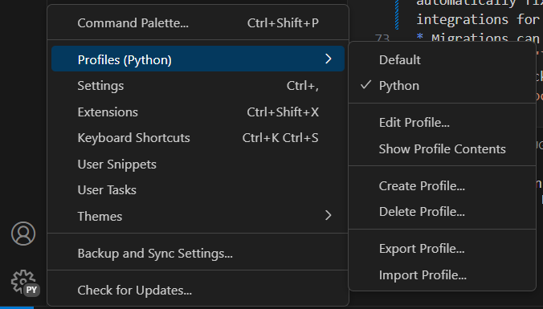

# Python POC

## Prerequisites

* Python 3.10+ (needs to be available in Path)
* Python poetry 1.7 (needs to be available in Path)
* PostgreSQL server.

## Development setup

### Poetry

Poetry installation documentation: https://python-poetry.org/docs/#installing-with-the-official-installer

The simpliest way is with a script (admin not required):

```powershell
(Invoke-WebRequest -Uri https://install.python-poetry.org -UseBasicParsing).Content | py - --version 1.7.0
```

In order to use python tools easily, it is best to add script path `%APPDATA%\Python\Scripts` to user environment variables. This has to be done through GUI. After editing user environment variables, a sign-out has to be performed.


You can verify successfull setup with `poetry --version` command.

### Additional recommended tools

* VSCode, installed as user mode application (alternatively, pycharm can be used)
* DBeaver, installed from zip, also as user mode application (recommended, alternative tools can be used, or IDE integrations)

Some extensions for vscode are recommended:
* Even Better TOML
* Python (from Microsoft with Pylance extension)
* Ruff

After creating a virtual environment, a `.venv` folder will appear in project directory, you should be able to select that as your project interpreter in vscode.

Tip for vscode: setup a python profile so extensions do not mix if you do any other work in vscode.



## Developing

* In commandline, switch into project directory.
* Run `poetry install --no-root`, this will create a python virtual environment and install packages into it.
After that, run `poetry shell` to get access to that environment.
    > **_Note For Windows users_** If you recieve an error message like `File ...\.venv\Scripts\activate.ps1 cannot be loaded because running scripts is disabled on this system`. To corrrect this please run the following command
    `Set-ExecutionPolicy -ExecutionPolicy RemoteSigned -Scope CurrentUser`
* After installation, a virtual environment will be created in `.venv` folder, setup this as your virtual environment in your IDE.
* Copy `.env.example` file to `.env` and modify DB connection string.
* Run migrations with command `dotenv run alembic upgrade head`. This will create schemas needed for application (note: migrations don't create the DB itself, it needs to be pre-created and specified in DB connection string). Look for a schema called `interview` in the DB.
* The server can be started either via IDE integrations for debugging (vscode launch config provided) or via unicorn `dotenv run uvicorn src.main:app --log-config log_conf.yaml`. After startin, access `http://127.0.0.1:8000/openapi` to view and use openapi page.
* Code can be formatted with `ruff format .`, code can be linted (and some things can be automatically fixed) with `ruff check --fix .`. VScode plugin Ruff provides editor integrations for these
* Migrations can be generated with `dotenv run alembic revision --autogenerate -m "{revision_name}"`. The autogenerate option requires accessible and up to date database.
* Tests can be run via IDE integrations or just by runing `pytest`. Before that, copy `.env.tests.example` to `.env.tests` and modify DB connection string (note: DB specified in connection string must be be pre-created).